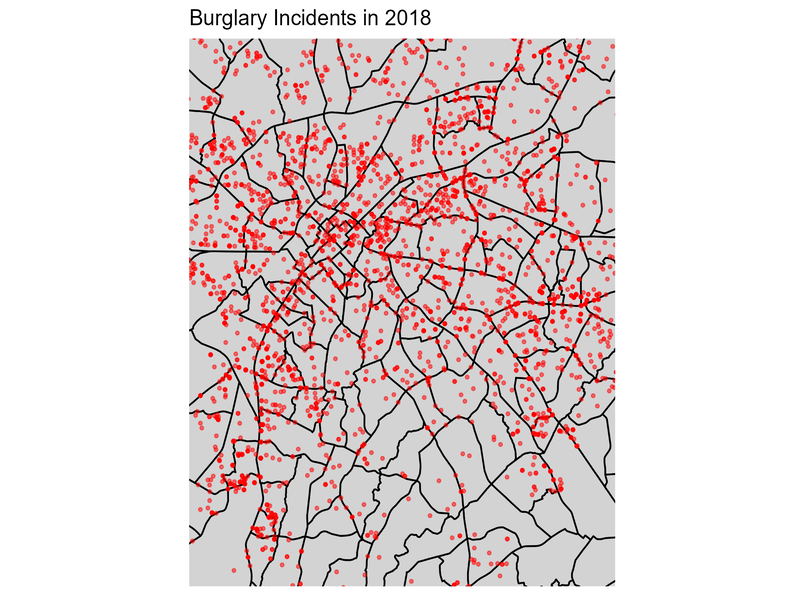

```{r setup, include=FALSE}
knitr::opts_chunk$set(echo = TRUE)
library(maps); library(ggplot2);
library(sf); library(ggpubr); 
library(gifski)
```

## Instructions

For this exercise, you will be tasked with creating a map of burglary incidents similar to the one I created in the **Data Visualization Part II: Analytic Graphs** lecture. I have provided you with CMPD data on burglary incidents in Charlotte-Mecklenburg county from 2016 to 2021. You will first process some shapefiles to build a map of the county, then restrict the range of this map to a set of latitudinal and longitudinal coordinates I will provide below. Finally, you will create a GIF just like the one I made in the lecture. Note that this file will be knitted to a .html, not a .pdf as normal. This is because a GIF will not appear properly in a PDF. 

## Question 1

Create a choropleth map depicting the distribution of murder rates across the United States (excluding Alaska and Hawaii). You will need to use the map_data() function within the ggplot2 package to import a map of the US as I do in lecture. Then, you will need to merge the map data with the USArrests data frame before creating the plot. 

```{r}
data("USArrests")
arrests <- data.frame(state=tolower(rownames(USArrests)), USArrests)
us_map <- map_data("state")
crime_map <- merge(us_map, arrests, by.x="region", by.y="state")
crime_map <- crime_map[with(crime_map, order(group, order)),]
ggplot(crime_map, aes(x=long, y=lat, group=group, fill=Murder)) +
  geom_polygon(color="black") +
  coord_map("polyconic")
```

Provide a 2-3 sentence description of the distribution of murder rates across the US. 

**Interpretation**: The distribution of murder rates across US States does exhibit a few clar patterns - first, high murder rates tend to be clustered in Southern states like Georgia, Mississippi, and Florida. Second, the lowest murder rates tend to be clustered in either the upper Northeast states or the upper Midwest states. The exception to this in the Northeast is NY, which has an uncharacteristically high murder rate for that region. 

## Question 2

Recreate the map of Charlotte-Mecklenburg county I made in lecture using the **Census_Tracts_2020** shapefile. You do not have to provide a description of this map - creating it satisfies the requirements for this question. 

```{r}
tracts_map <- read_sf("Shapefiles/Census_Tracts_2020.shp")
ggplot() +
  geom_sf(data=tracts_map, fill="lightgrey", color="black") +
  coord_sf()
```

## Question 3

Next, use the coord_sf() function to restrict the map you created for Question #3 to range from 35.10 to 35.30 on the y-axis and from -80.91 to -80.71 on the x-axis. This corresponds to the center of the city of Charlotte and its surrounding areas.  

```{r}
ggplot() +
  geom_sf(data=tracts_map, fill="lightgrey", color="black") +
  coord_sf(xlim=c(-80.91, -80.71), ylim=c(35.10,35.30), expand=FALSE)
```

## Question 4

Now, use the read_sf() function to read in the **CMPD_Incidents** shapefile. This is a somewhat large file, so it may take some time to load in. Be sure to provide a name for this new object.  

```{r}
incidents <- read_sf("Shapefiles/CMPD_incidents.shp")
```

Next, subset that data so that you have three data sets for the years 2018, 2019, 2020, and 2021 that only include burglaries. The character value for burglaries is "Burglary/B&E". After this, you should have four separate data sets, each with their own name (e.g., burglaries_2018, burglaries_2019, ...). After this, you may remove the original data if you need the space. 

```{r}
burglaries_2018 <- subset(incidents, HIGHEST__1=="Burglary/B&E" & YEAR=="2018")
burglaries_2019 <- subset(incidents, HIGHEST__1=="Burglary/B&E" & YEAR=="2019")
burglaries_2020 <- subset(incidents, HIGHEST__1=="Burglary/B&E" & YEAR=="2020")
burglaries_2021 <- subset(incidents, HIGHEST__1=="Burglary/B&E" & YEAR=="2021")

rm(incidents)
```

## Question 5

Next, produce four different maps, one for each year of burglary data. Be sure to apply appropriate titles for the graphs and to adjust the size and color of the points that represent burglary incidents. You should store each plot as an object (e.g., burglaries_2018_plot, burglaries_2019_plot, ...) because you will use them later to create a GIF. Finally, save each plot as a .png file using the ggsave() function. Make sure you are saving these plots within a subfolder where your current .rmd file is (look at my lecture code for an example of this). 

```{r}
burglaries_2018_plot <- ggplot() +
  geom_sf(data=tracts_map, fill="lightgrey", color="black") +
  geom_sf(data=burglaries_2018, color="red", alpha=0.5, size=0.75) +
  coord_sf(xlim=c(-80.91, -80.71), ylim=c(35.10,35.30), expand=FALSE) +
  theme(axis.title.x=element_blank(),
        axis.text.x=element_blank(),
        axis.ticks.x=element_blank(),
        axis.title.y=element_blank(),
        axis.text.y=element_blank(),
        axis.ticks.y=element_blank()) +
  ggtitle("Burglary Incidents in 2018")

burglaries_2019_plot <- ggplot() +
  geom_sf(data=tracts_map, fill="lightgrey", color="black") +
  geom_sf(data=burglaries_2019, color="red", alpha=0.5, size=0.75) +
  coord_sf(xlim=c(-80.91, -80.71), ylim=c(35.10,35.30), expand=FALSE) +
  theme(axis.title.x=element_blank(),
        axis.text.x=element_blank(),
        axis.ticks.x=element_blank(),
        axis.title.y=element_blank(),
        axis.text.y=element_blank(),
        axis.ticks.y=element_blank()) +
  ggtitle("Burglary Incidents in 2019")

burglaries_2020_plot <- ggplot() +
  geom_sf(data=tracts_map, fill="lightgrey", color="black") +
  geom_sf(data=burglaries_2020, color="red", alpha=0.5, size=0.75) +
  coord_sf(xlim=c(-80.91, -80.71), ylim=c(35.10,35.30), expand=FALSE) +
  theme(axis.title.x=element_blank(),
        axis.text.x=element_blank(),
        axis.ticks.x=element_blank(),
        axis.title.y=element_blank(),
        axis.text.y=element_blank(),
        axis.ticks.y=element_blank()) +
  ggtitle("Burglary Incidents in 2020")

burglaries_2021_plot <- ggplot() +
  geom_sf(data=tracts_map, fill="lightgrey", color="black") +
  geom_sf(data=burglaries_2021, color="red", alpha=0.5, size=0.75) +
  coord_sf(xlim=c(-80.91, -80.71), ylim=c(35.10,35.30), expand=FALSE) +
  theme(axis.title.x=element_blank(),
        axis.text.x=element_blank(),
        axis.ticks.x=element_blank(),
        axis.title.y=element_blank(),
        axis.text.y=element_blank(),
        axis.ticks.y=element_blank()) +
  ggtitle("Burglary Incidents in 2021")
```

```{r}
ggsave("Plots/2018.png", plot=burglaries_2018_plot)
ggsave("Plots/2019.png", plot=burglaries_2019_plot)
ggsave("Plots/2020.png", plot=burglaries_2020_plot)
ggsave("Plots/2021.png", plot=burglaries_2021_plot)
```

## Question 6

Finally, create a GIF of the burglary plots. Use the code I use (with required adjustments for these plots) in the lecture .rmd file to show the GIF in your knitted file. Provide a 3-4 sentence description of any changes in the spatial distribution or amount of burglaries over this time period. 

```{r}
png_files <- list.files("Plots/", pattern=".png$",
                        full.names=TRUE)

gifski(png_files, gif_file="burglaries_animation.gif", 
       width=800, height=600, delay=1)
```



**Interpretation**: The distribution of burglaries across central Charlotte does change slightly over time, but mostly decreases. In the earlier time period (2018 and 2019) burglaries are more frequent and spread out. Beginning with 2020, there are fewer burglaries and these are less spread out than before. Most of the burglaries in this latter time period tend to cluster in areas that were already experiencing more frequent burglaries. 