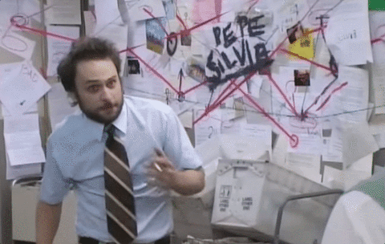
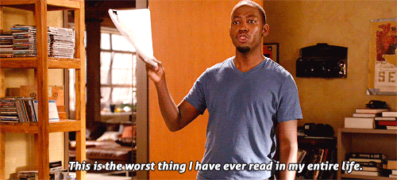
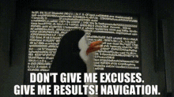
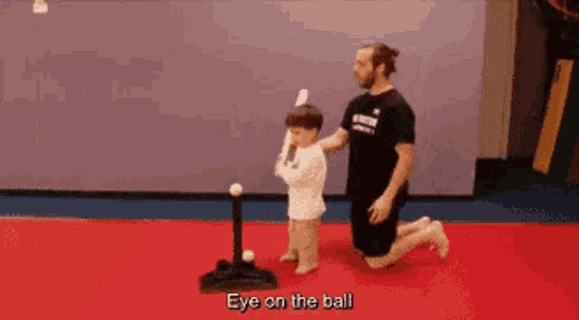
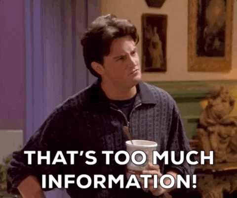

```{r setup, include=FALSE}
knitr::opts_chunk$set(echo = TRUE)
```

# Outline

In this short lecture I am going to discuss several different aspects of communicating results from a research project. We will focus on:

I.  Communicating Results in Written Form
II.  Communicating Results in Presentation Format
III.  Best Practices for Presenting Results in Person

# Communicating Results in Written Form

There are a few topics I will cover in this section and some of this advice I have already mentioned throughout the semester. 

I'll first go over how to best structure a research paper such that you guide a reader from a central research question to its conclusion in your results/discussion section. 

## Outlining a Good Research Paper
  
Unless you begin with an outline, you're doing it wrong. An outline is extremely important toward writing a well-structured research paper because it forces you to think about how the information you want to communicate can be organized into distinct sections. 



One way I notice that students can go wrong here is to assume that readers know the structure themselves and can intuitively understand the points they are making and that these points are sequentially or contextually related. 

The problem with that assumption is that the author (i.e., the student) has immersed themselves in that information, and it becomes difficult to separate what the author thinks makes sense from what a novice reader thinks makes sense. 

It's not easy to separate yourself from what you know. What seems logical to you may require additional explanation for others because they don't have the context you have. 

This is why it is helpful to outline a section **before** you begin writing because you can more easily make sure that each outline entry follows from the last one. 

One helpful suggestion I have for this process is to take the topic sentences from each paragraph in an article you think has a good introduction and literature review. Take a look at how those topic sentences fit together (or don't!) - a well-structured introduction and literature review will have topic sentences that fit together very well, even in the absence of contextualizing information in the paragraphs you took them from. 

Let's practice this now with two studies I have posted to Canvas: 

1) "Damned if you do, damned if you don't" by Sade Lindsay in Criminology (2022)
2) Race, work history, and the employment recidivism relationship by Simon G. Kolbeck, Paul E. Bellair, and Steve Lopez, also in Criminology (2022)

## Bad First Drafts
  
The draft you hand in should **not** be the first draft, even when you can revise and resubmit. 

Your first draft should be a bit of an information dump, in that you are populating an outline with information to fill in each subsection. Not all of this information will be necessary, and you may find that some subsections are redundant with others after you've filled them in. 

One of my favorite pieces of advice about first/second drafts comes from author Neil Gaiman ("Sandman", "American Gods"). When writing a story, the first draft should cover all of the events that happen in the story from beginning to end. Then, in the second draft, you fill in all the details as if you knew all of those events would occur in the first place. 



As applied to the drafting process, this means that you outline the important sections first, fill in the information that logically goes into those sections, then revise that first draft to be as if you knew the right story to tell from the start. 

Suffice to say, your first draft will (usually) not be very good. Don't submit the first draft. Use that drafting process to fill in necessary details, then refine that story in the second drafting stage.

**Side note**: Finish your introduction *last*. Then, your conclusion/discussion should almost be a mirrored version of the intro, but with all the answers to your research question(s). 

## Revising Tips

Read your writing out loud. If it sounds award out loud, it reads that same way. On a similar note, say one thing with each sentence (maybe two). Any more than that is overkill. 

When proofreading for errors go sentence by sentence, but begin at the end of the document. This is because our minds will tend to skip forward when reading from beginning to end (you've already written it that way, so your mind is going to try to gloss over the finer details). 

The problem there is that the finer details are exactly what you want to pay attention to during the proofread stage. So, if you start from the end and work backwards this will prevent the natural inclination toward skipping forward. 

# Communicating Results in Presentation Format

One simple phrase can sum up almost everything I am about to tell you: keep it simple. 

That's it. 

What that means in terms of presentation design does require some elaboration, though. So here goes...

## Slide Design - Good, Bad, and the In-Between

Less really is more. 


I have seen many a presentation where the presenter merely read the text on the slide to the audience and this is entirely unnecessary (unless your audience cannot read) and can be considered rude. 

Doing this can also result in two undesirable events :

1) The audience stops paying attention to you and just reads the screen
2) The audience becomes frustrated as they try to read the screen and you are saying the words out loud simultaneously. 

Here are some standards for effective slide design that will allow you to avoid those undesirable events. 

### Less Is More
  
On any particular slide you should be making one or two broad points that carries your presentation forward. 

These points should be summarized succinctly in the form of short, concise statements or questions. 

You **should** elaborate on these points, but that elaboration comes from you speaking to the audience, not reading the words on the slide to them. 

Here's an example of when this is done wrong:


Note how many lines of text there are here - it's pretty intimidating to see that as an audience member but also makes it very difficult to follow along with the presenter. 

That, and it's unclear just how much of the information on this slide I need to pay attention to as an audience member. 

Now, here's an example when this is done right (or, at least better:


Note the difference - just 5 lines of very short text that each have a clear takeaway point or message. Interpret the spaces between these points as the places where your presentation fills in the blanks to connect them. 

## The Three C's of Effective Slide Design

This leads me to the three C's of effective slide design:

- Content
- Contrast
- Creativity

These are not in rank order. 

### Applying the 3 C's to Slide Design

One theme per slide. That's it. The theme itself could a particular aspect of the background literature, describing your sample, describing your (important) measures, or displaying your results. 

In any of those cases, only do one thing at a time on a slide. Multiple themes on a slide can confuse both you and your audience. 

Here's a series of examples: 


Although this slide is not very bad, there are a few elements that could be improved. For starters, it has two themes:

1) Incarceration is high
2) Incarceration is concentrated in some communities more than others

We could extract each of those points and give them a slide of their own (and maybe even add an additional point).


I focus just on the first theme here - that incarceration is high. I use statistics within the slide and try to position the text in such a way that it contrasts with the background photo. 

I could talk a bit more about these statistics in my delivery of the slide. The text does not need to be on the slide itself. 


Here's the second theme - the growth in incarceration is concentrated in certain communities much more than others. 

Again, I can discuss this concentration in my delivery of the slide, text does not necessarily have to be on the slide itself. 


Finally, the last theme - I can discuss here the effect of incarceration on particular sub-populations, and also connect this with a broader issue (education). 

I'm not saying the slides above are the best example out there, but they do illustrate a way to keep themes minimal for each slide, to provide effective contrast between the text on the slides and the images, and to add a dose of creativity into the slides so it's a little more imaginative than some bullet points on blank canvas. 

## How to Show Literature Review?

Broad bullet points for a particular theme are good, with no more than three bullet points per theme. Try to limit yourself to one (maybe two) important themes per slide. 

Also, you should NOT include full citations on each slide. Rather, include them in in-text citation form (author, year) and if more than two authors abbreviate it to: (first author last name et. al., year). 


As far as how many slides this should encompass, this will depend on your audience. 

1) If your audience is full of subject-matter novices, more guidance is necessary. For example, you will want to explain why theory predicts a relationship between two variables a bit more AND provide evidence that confirms this. 

2) If your audience is full of subject-matter experts, get to your methods and results quickly. The audience already knows the theory and (probably) knows the research you cite. Take this time and instead dedicate it to explaining your methods and results. This doesn't mean to exclude the lit review section entirely, just to dedicate comparatively less time to it. 

3) If your audience is a mixture of the two, err toward explaining more about your lit review. Try to then explain the methods and measures as simply as you can and be sure to clearly communicate your results. Overall, spend more time on the lit review and results, especially if you are presenting to policy makers. 

In the presentation for this class, you must assume you are delivering to a novice audience, so make sure to spend some time making your literature review section **very** clear and try your best to be economical about time spent on it (explain enough for a novice, but not more). 

## How to Describe Methods?

In this section, you need to be **very** clear but not necessarily completely comprehensive. There will be a **lot** of information to choose from in describing your sample, their typical characteristics, and the important measures for your analysis. Your task is to identify the minimum amount of information required to understand your sample and measures and then layer on information from there if time allows. 

### Sample Description

Describe:
1) How was the sample collected? When? 
2) Was this a probability or non-probability sample? 
3) Do you use the full sample for your analysis or just parts of it?


Be sure to provide sample sizes! If you use a subsample, be sure to identify the total sample size and the size of your subsample. 

Provide descriptive statistics for your important variables (IVs and DVs) and also any relevant controls as they can fit into your discussion. For example, if your outcome is delinquency or crime, the distribution of biological sex in your sample is probably important, even if it's just a control variable. Same goes for age. 

Do **NOT** provide descriptive statistics for every single variable you use **within** the slides describing your sample and measures. Instead, full tables can be included after your final slide to refer to if the audience has questions about other variables. This is a helpful trick for a lot of extra content other than sample information. 

### Measure Description

You will need to include enough information here to provide the necessary context for interpreting the results, but not too much that you get "lost in the weeds." That is, discussing the intricacies of measurement can get you far off topic and inundate listeners with unnecessary details. 


Some suggestions:

1) Balance the depth of description of a measure to its importance for your analysis. Your primary independent variables and dependent variable should be described most comprehensively, everything else needs less detail. 

2) If variables have similar measurements (e.g., opinion scales) try to group their descriptions together. 

3) Cite sources for your measures where appropriate (e.g., if a scale developed by an author, cite paper for it).

4) Include descriptive statistics for important measures only (see above). Full tables on tiny slides are a bad idea. 

5) If you have many variables, try to group your descriptions by theme (e.g., crime & delinquency, demographics, etc...). 

For the purposes of this class, your measures have almost always been developed by others, so you do not have to provide very lengthy justifications for measuring particular concepts in a certain way - merely that the concept is best measured by that measure in this data set. 

On that last note, be mindful of the difference between conceptualization and operationalization. Not every measure is going to perfectly encapsulate the definition of a concept, so acknowledge limitations where they exist. 

### Statistical Analysis

If complicated, a statistical model could take 2-3 slides to explain. 

However, the research project for this class requires only simple statistical models, so you should be able to explain the model with just one slide. 

Guidelines for explaining the statistical model:

1) Identify the name of the model (e.g., multivariate OLS, logistic regression, etc...)
2) Clearly identify the independent and dependent variables
3) Make sure you satisfy the assumptions of the model (checks can go on slides after the conclusion).
4) If OLS, make sure you transform variables as required to approximate linear relationships (and explain why). 

## How to Describe Results?

**Never** in a table that is filled with every coefficient from the model (unless there are fewer than 3-4 variables in the model). 

If you can display your results without a table (e.g., using a figure), even better. 



If you elect to display your results in a table, be sure to only include the relevant coefficients in the table (but be sure to explain that you omit them in that output). You can include a full table of results after the conclusion if an audience member has a question. 

Note that these are not separate models - you run the model once, then just report select pieces of the results in your results table. 

Unless your results are very complicated, anticipate using a single slide to display and discuss your results. 

One alternative way to display the results I have seen is to begin the presentation with the results then work up to them. It's pretty effective at keeping an audience engaged, from my anecdotal experience using the method. 

## How to Describe the Conclusion/Discussion?

Use 2 to 3 slides for this. The conclusion is one slide and it summarizes your results with respect to your research question (i.e., which results are consistent/inconsistent with your expectations?). 


The next slide or two should be used for your discussion. In this section you should include:

1) An explanation of why your results were inconsistent with expectations (if they were)
2) Policy/theoretical takeaways from your research (i.e., why does this matter?)
3) Limitations of your design
4) What should be researched next

# Best Practices for Presenting Results in Person

Practice. A lot. 



In almost any verbal presentation you will have a limit on your time. There's no (good) way to know if you exceed this limit without practicing the presentation beforehand. Note that general rules like "1 minute per slide" may help to estimate if you will exceed your time, but this is not a foolproof method. The only way to know for sure is to practice. 

When it comes to practice I'm a bit extreme about it - I usually practice a presentation about ten to fifteen times before I actually deliver it. I recommend at least half that for you. 

## What Does Practice Get You?

Think of practicing a presentation like the second stage of the manuscript drafting process. Essentially, you are reading the slides out loud and making sure that the story you are telling moves logically from slide to slide. 

Practicing delivering the presentation will often reveal parts that do not work well. For example, you can identify parts of the presentation that do not have proper context (e.g., have I guided listeners to this point or is this an abrupt conclusion or change in topic?), identify sections that are redundant (e.g., have I already said this?), or identify sections that require further development (e.g., is my verbal description of this slide too short?).

You'll often find that the wording on some slides leaves you a bit tongue-tied. Remember that the written prompts on the slide are there for you as well. The text on the slide are there to remind you of what to talk about next, and you want these short prompts to be easy to say out loud **and** to sufficiently jog your memory about what you should discuss next. 

## Should You Use Notecards?

At first, sure. But, consistent with the prior section, eventually you will have practiced enough such that your notecards are more of a distraction than a presentation aid. 


As such, I tend to think of notecards like training wheels. They are there to assist you as you are learning the best way to deliver the presentation. Once you identify the best way, though, they become a distraction or nuisance. 

## What Do I Do With Irrelevant Information?

If you happen to identify some irrelevant information during the practice stage, you have a few options for what to do with it. 



1) Get rid of it. Killing your darlings (words) can be tough, but it becomes easier over time. 
2) If you absolutely **must** keep that information, put it after the conclusion slide and **only** reference it if there is a question related to that content. 

In almost all circumstances, unless the irrelevant information has to do with my results/statistical analysis, I get rid of it. 

All else equal, shorter presentations are better presentations. 

# Two Questions

What are your two questions today?

