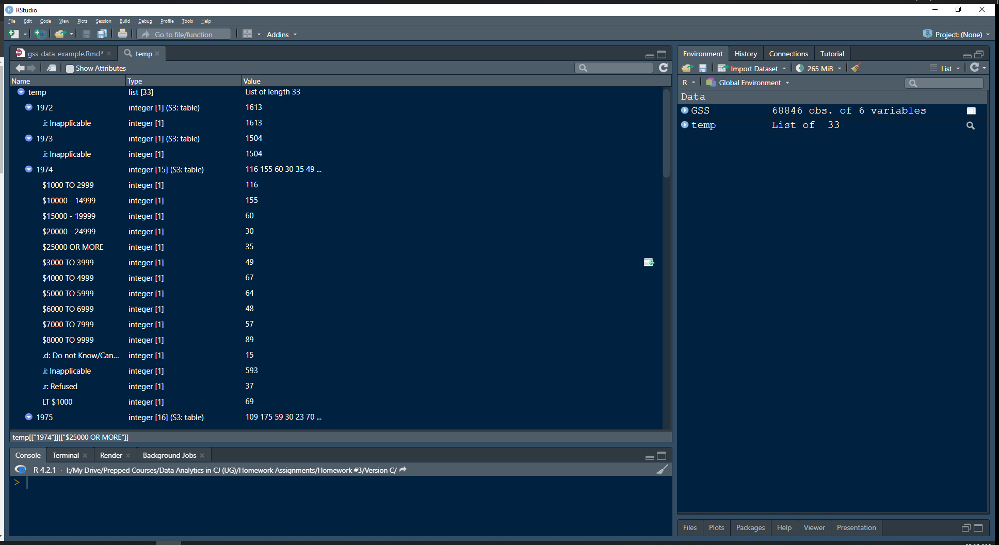

```{r setup, include=FALSE}
knitr::opts_chunk$set(echo = TRUE)
```

In the following document I am going to guide you through some initial steps in the process of accessing some data I have downloaded from the GSS. This is a simple example with just a few variables. I've just downloaded some information about respondents' age, sex, and personal income. 

## Import GSS Data

```{r}
library(readxl)
GSS <- read_excel("GSS.xlsx")
```

## Inspect Data Frame

```{r}
class(GSS)
str(GSS)
```

The class appears strangely here - it brought this in as a tibble, which is not necessarily bad, but I want to keep it stored as a simple data frame, so I'm going to change the class of the object and then check to see if the change worked. Side note - a tibble is a different way to store a data frame that began (to the best of my knowledge) with the tidyverse package. 

```{r}
GSS <- as.data.frame(GSS)
class(GSS)
str(GSS)
```

Good, nothing changed about the data, merely its class. 

## Changing Values of a Variable - Missing Values

Next step - there are some strange values in the **rincome** variable. Let's take a look at them using the table() function.

```{r}
table(GSS$rincome)
```

So, there are a few things to note here:

- ".i: Inapplicable" is there because the question was not asked in that year or ballot OR the answer to a lead in question (i.e., are you employed?) causes this question to be skipped. 
  - a "ballot" refers to the different versions of the survey the GSS distributes every year. Not everyone sees exactly the same questions. 
- There are a few other values that I should set to missing here, including ".n: No answer" and ".d: Do not Know/Cannot Choose"
  - I should **NOT** set these values to zero without . There's no way for me to infer that these respondents have no income from these missing value categories. 

Let's take a look at the distribution of personal income by year to see if there are detectable patterns here. 

I'm going to use the tapply() function to accomplish this - it runs an operation (the third argument) on an object (the first argument) over some index (the second argument). 

Here, the operation is the table function, the object is the personal income variable (rincome) and the index is the year variable. So, it will provide a frequency table for the rincome variable for each unique year in that variable. 

```{r}
temp <- tapply(GSS$rincome, GSS$year, table)
```

I store the results as an object so I can visually inspect it. 



From what I see, it seems that the personal income question is not asked in 1972 or 1973, but is asked starting in 1974. The pattern of results suggests that the question is only asked if the respondent reports being employed. 

Replacing these missing values will be a little more complicated, as we have to now use more complex conditions to replace some values as missing and others as 0 (reflecting no income). 

Here goes nothin'...

```{r}
GSS$pers_income <- GSS$rincome # First, create a new variable to recode

GSS$pers_income[GSS$pers_income==".i:  Inapplicable" & # Note the two spaces!
                  (GSS$year==1972 | GSS$year==1973)] <- NA
# Sets pers_income to missing in years when question was not asked

GSS$pers_income[GSS$pers_income==".i:  Inapplicable" & GSS$year>=1974] <- "$0"
# Sets value to zero income in years where question was asked and R not employed

GSS$pers_income[GSS$pers_income==".s:  Skipped on Web" | 
                GSS$pers_income==".d:  Do not Know/Cannot Choose" | 
                GSS$pers_income==".n:  No answer" |
                GSS$pers_income==".r:  Refused"] <- NA
# Sets true missings to NA

table(GSS$rincome, GSS$pers_income, useNA="ifany") # Compare variables to check recode worked
```

Looks like it worked! What I am looking for here is if the new variable values reflect the changes I made relative to the old variable. It's a useful technique to make a cross tabulation of the old and new values to see if your code worked!

## Adding New Data

As you progress in your analysis you may find yourself asking if you need additional data from the GSS. Adding variables **can** be a pretty simple process. I'll guide you through a simple example first, then we are going to complicate matters. 

### New Data

I have decided to add a few more variables to these data. This will probably come up if you decide to use the NLSY97 or the GSS, as the most common way to use these data is to download multiple variables at a time.  
