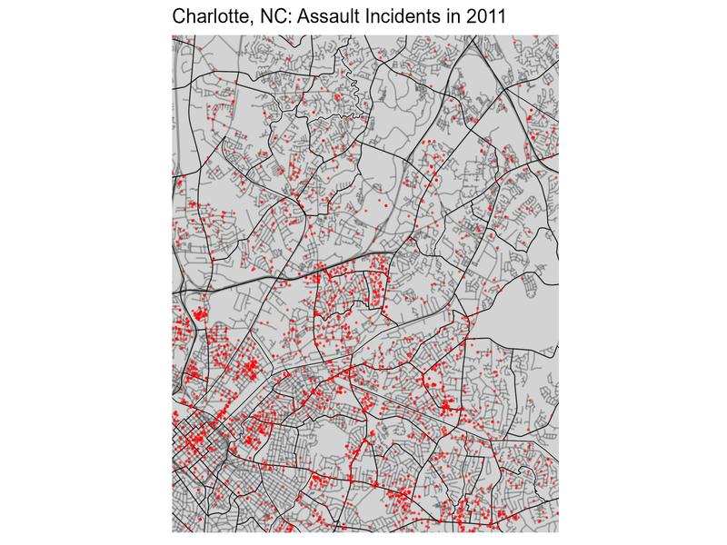

```{r setup, include=FALSE}
knitr::opts_chunk$set(echo = TRUE)
library(maps); library(ggplot2);
library(sf); library(ggpubr); 
library(gifski); library(gcookbook);
library(igraph); library(igraphdata);
library(visNetwork); library(shiny);
library(sp)
```

## Data Visualization Part II: Analytic Graphs

Analytic graphs are different from exploratory graphs in that the graphs themselves can be the entire focus of an analysis. Whereas a histogram or scatterplot will describe a sample or depict a bivariate relationship that precedes a more formal statistical analysis, an analytic graph - such as a map or sociogram (a social network plot) - often IS the analysis (or, at least the most significant part of it). 

The principles of a good exploratory visualization also apply to analytic graphs, in that:

- It should be very clear what the overall point of the graph is (i.e., what result is it meant to display?).
- It should have clear titles and labels.
- All markers, points, etc... should be explained fully, ideally with a simple legend. 
- The choice of how to visualize the data should be appropriate for the types of data you are using. Even in maps or sociograms, some plotting techniques will only work with particular kinds of variables. 

## How are Maps and Network Graphs Different?

There are multiple differences between these types of graphs and the simpler exploratory visualizations we discussed in the prior lecture, chief among them is the structure of the data. 

To create a map, the data need to have coordinates for events or be stored according to some type of geographic unit. For the former, we generally want longitude and latitude coordinates. 

For the latter, the geographic unit can be most anything - city blocks, census tracts, counties, states, even countries. The important part is that there are indicators in the data that tell R which geographic unit each observation belongs to so that it knows how plot the data. 


For social network graphs (sometimes called sociograms, as above) the data are instead in the form of directional or non-directional ties between nodes in the data. 

In social network parlance, a node is simply an individual observation that can have ties to other observations in the data. These ties could be between people, businesses, police departments, courts, etc...

The direction of a tie has to do with what information you have about the tie and how you obtained it. For example, if we interview individuals in a particular neighborhood of the city, then interview the people they identify as friends, we can know the direction of the tie. 

In this example, Person A reports Person B as a tie (outward tie from A to B) and then we go interview Person B. Unfortunately for Person B, Person A does not report them as a tie, so the tie between A and B only goes in one direction (and we don't tell Person A because that would just be mean). 

If, however, Person B did report Person A as a tie, the relationship would be bidirectional - the tie goes from A to B **and** from B to A. 


What this means for the format of social network data is that the file needs to have rows for each node and columns for all the ties they report. If you want to link information about ties across multiple groups of nodes, the node names then have to be standardized over all rows. 

This is quite different from what you're used to seeing in the data frames for this and other classes, and I'll show you an example of such data before I show you how to plot a sociogram. 

## Map Data and A Basic Map

For this exercise we will use the "maps" package in R. You can run install.packages("maps") to get it installed on your computer. We will also be using the USArrests data frame that comes with base R. 

First, let's call in the US Arrests data frame:

```{r}
data("USArrests")
```

Now, let's inspect those data using the head() function:

```{r}
head(USArrests, 10)
```

The only geographic unit I have here are the names of the states, but for each geographic unit I do have a few different variables, so I could plot these on a map to, for example, look at homicide rates across the 48 contiguous states. 

First, I need to prepare the data to merge with a map file. The map file has state names in all lower case, so I need to change the rownames in the USArrests data frame to be all lower case as well, otherwise the merge will not work:

```{r}
arrests <- data.frame(state=tolower(rownames(USArrests)), USArrests)
```

Not only did that make the state names lower case, but it also created a new column storing those values - we needed both for merging. 

Now, let's bring in a map of the 48 contiguous states using the map_data function:

```{r}
us_map <- map_data("state")
```

Let's take a quick look at that data set, too.

```{r}
head(us_map, 15)
```

Every row in that data frame represents a paired lat/lon coordinate that draws borders around each of the 48 contiguous states. This explains why there are over 15,000 observations in those data - those are lots of coordinates to plot!

Now, let's merge the files together so we can make a map with some state crime rates:

```{r}
crime_map <- merge(us_map, arrests, by.x="region", by.y="state")
```

Okay, let's take a look at the merged file and see what we have:

```{r}
head(crime_map, 10)
```

Okay, state is now region and we have added the crime rates to the map data. Notice that the crime data do not vary within the first 10 rows. Why do you think that is? 

Well, that's because the first 200 rows or so are just for Alabama, so the crime rate values should all remain the same within a single state. 

One thing to note from above - there are two variables called *group* and *order* that ar meant to provide direction to R regarding the order that the observations need to be ploted. This will not always be present in your map data, but it is here, so we need to pay attention to it. Right now, it's out of order...let's see what happens when we plot it without sorting the values:

```{r}
ggplot(crime_map, aes(x=long, y=lat, group=group, fill=Assault)) +
  geom_polygon(color="black") +
  coord_map("polyconic")
```

And that's what I get for plotting too early...

Let's make sure the order is correct, then try that again.

```{r}
crime_map <- crime_map[with(crime_map, order(group, order)),]
head(crime_map, 10)
```

Much better. Let's try that map again:

```{r}
ggplot(crime_map, aes(x=long, y=lat, group=group, fill=Assault)) +
  geom_polygon(color="black") +
  coord_map("polyconic")
```

And there you have it! We have just made what is called a **choropleth** map. A **choropleth** map is simply a map that shades or draws geographical units differently according to one or more characteristics. 

That's what making a map looks like with pre-existing map data in R and with variables that are constant within a geographic unit but what about when you just want to plot events within a smaller geographic unit?

## A More Complicated Map - Assaults in Charlotte (2011 to 2016)

I have some data on all incident reports from the Charlotte-Mecklenburg Police Department (CMPD) from 2011. I'll first bring in a shapefile for Mecklenburg County. We will have to use some functions from the **sf** package to import a shapefile. 

You can obtain various geographic files for Charlotte from the county's open data portal: http://maps.co.mecklenburg.nc.us/openmapping/data.html

```{r, warning=FALSE}
meck_map <- read_sf("Shapefiles/MecklenburgCounty_Boundary.shp")
```

Note that you will need to include in the folder with the .shp file any additional files associated with the shapefile. In this circumstance, there are several, including a .dbf, a .sbn, and another .shp file. 

Okay, now let's actually make the map. 

```{r} 
ggplot(meck_map) +
  geom_sf() +
  coord_sf()
```

That's a good start, but we can add some layers to this to improve its appearance. 

```{r, output=FALSE}
streets_map <- read_sf("Shapefiles/Streets.shp")
block_groups_map <- read_sf("Shapefiles/Census_BlockGroups_2020.shp")
```

Now, let's add those new elements to the plot:

```{r}
ggplot() +
  geom_sf(data=block_groups_map, fill="lightgrey", color="black") +
  geom_sf(data=streets_map, color="white", alpha=0.25)
  coord_sf()
```

### Adding the Crime Data

Okay, now that we have added block groups and streets, it's time to import the crime data. 

```{r}
cmpd_2011_map <- read_sf("Shapefiles/incident_2011.shp")
```

As you can tell, the file is very large - there were just under a quarter million incident reports filed by the CMPD in 2011 alone. This is probably too much to plot in this figure without overloading the plot with points.

Let's subset the data by a particular type of crime to reduce the number of points. I'll select just aggravated assaults for now: 

```{r}
cmpd_2011_assaults_map <- cmpd_2011_map[
  cmpd_2011_map$c__2011_N=="Aggravated Assault", ]
str(cmpd_2011_assaults_map)
```

Much better! Now let's add it to the plot. 

```{r}
ggplot() +
  geom_sf(data=block_groups_map, fill="lightgrey", color="black") +
  geom_sf(data=streets_map, color="white", alpha=0.25) +
  geom_sf(data=cmpd_2011_assaults_map, color="black", alpha=0.5, size=0.25) +
  coord_sf()
```

The Census blocks make this a little too busy. Let's instead go with Census tracts to clean up the plot a little. 

```{r}
tracts_map <- read_sf("Shapefiles/Census_Tracts_2020.shp")
ggplot() +
  geom_sf(data=tracts_map, fill="lightgrey", color="black") +
  geom_sf(data=streets_map, color="white", alpha=0.25) +
  geom_sf(data=cmpd_2011_assaults_map, color="black", alpha=0.5, size=0.25) +
  coord_sf()
```

Not much better, but that's the largest aggregation available from the Census, so it is what it is. 

### Zooming the Plot in on a Specific Geographic Area

One thing we may want to do is to focus on a specific area of the map - let's say we want to look specifically at the area around UNCC. If we want to do this, we need to specify the limits of the X and Y axes within the coord_sf() function like so:

```{r}
ggplot() +
  geom_sf(data=tracts_map, fill="lightgrey", color="black") +
  geom_sf(data=streets_map, color="black", alpha=0.25) +
  geom_sf(data=cmpd_2011_assaults_map, color="red", alpha=0.5, 
          size=0.75) +
  coord_sf(xlim=c(-80.85, -80.70), ylim=c(35.20,35.35), expand=FALSE)
```

Okay, I'm happy with how this currently looks. We clearly see a gap in assault incident reports in the campus area and this is partially due to there being few assaults and reporting methods of police on the UNCC campus (the address is usually reported as the main address for the campus). 

Now it's time for some rudimentary analysis of clustering of assaults over time. That is, do the clusters of red dots representing assault incident reports remain constant over time? We can examine this by creating the same plot for 2012 through 2016, then combining them. 

First, we need to import the shapefiles and select only the assault incidents from each. 

```{r}
cmpd_2012_map <- read_sf("Shapefiles/incident_2012.shp")
cmpd_2012_assaults_map <- cmpd_2012_map[cmpd_2012_map$c__2012_N=="Aggravated Assault", ]

cmpd_2013_map <- read_sf("Shapefiles/incident_2013.shp")
cmpd_2013_assaults_map <- cmpd_2013_map[cmpd_2013_map$c__2013_N=="Aggravated Assault", ]

cmpd_2014_map <- read_sf("Shapefiles/incident_2014.shp")
cmpd_2014_assaults_map <- cmpd_2014_map[cmpd_2014_map$c__2014_N=="Aggravated Assault", ]

cmpd_2015_map <- read_sf("Shapefiles/incident_2015.shp")
cmpd_2015_assaults_map <- cmpd_2015_map[cmpd_2015_map$c__2015_N=="Aggravated Assault", ]

cmpd_2016_map <- read_sf("Shapefiles/incident_2016.shp")
cmpd_2016_assaults_map <- cmpd_2016_map[cmpd_2016_map$c__2016_N=="Aggravated Assault", ]

rm(list=c("cmpd_2011_map", "cmpd_2012_map",
          "cmpd_2013_map", "cmpd_2014_map",
          "cmpd_2015_map", "cmpd_2016_map"))
```

I removed the original files before moving forward because my global environment is getting a bit crowded. Maps can take up a lot of memory and can slow R down considerably. 

Now, I need to make the same plot as above, but one for each year. I will then wrap them all together into one figure. 

```{r}
assaults_2011 <- ggplot() +
  geom_sf(data=tracts_map, fill="lightgrey", color="black") +
  geom_sf(data=streets_map, color="black", alpha=0.25) +
  geom_sf(data=cmpd_2011_assaults_map, color="red", alpha=0.5, 
          size=0.25) +
  coord_sf(xlim=c(-80.85, -80.70), ylim=c(35.20,35.35), expand=FALSE) +
  theme(axis.title.x=element_blank(),
        axis.text.x=element_blank(),
        axis.ticks.x=element_blank(),
        axis.title.y=element_blank(),
        axis.text.y=element_blank(),
        axis.ticks.y=element_blank()) +
  ggtitle("Charlotte, NC: Assault Incidents in 2011")

assaults_2012 <- ggplot() +
  geom_sf(data=tracts_map, fill="lightgrey", color="black") +
  geom_sf(data=streets_map, color="black", alpha=0.25) +
  geom_sf(data=cmpd_2012_assaults_map, color="red", alpha=0.5, 
          size=0.25) +
  coord_sf(xlim=c(-80.85, -80.70), ylim=c(35.20,35.35), expand=FALSE) +
  theme(axis.title.x=element_blank(),
        axis.text.x=element_blank(),
        axis.ticks.x=element_blank(),
        axis.title.y=element_blank(),
        axis.text.y=element_blank(),
        axis.ticks.y=element_blank()) +
  ggtitle("Charlotte, NC: Assault Incidents in 2012")

assaults_2013 <- ggplot() +
  geom_sf(data=tracts_map, fill="lightgrey", color="black") +
  geom_sf(data=streets_map, color="black", alpha=0.25) +
  geom_sf(data=cmpd_2013_assaults_map, color="red", alpha=0.5, 
          size=0.25) +
  coord_sf(xlim=c(-80.85, -80.70), ylim=c(35.20,35.35), expand=FALSE) +
  theme(axis.title.x=element_blank(),
        axis.text.x=element_blank(),
        axis.ticks.x=element_blank(),
        axis.title.y=element_blank(),
        axis.text.y=element_blank(),
        axis.ticks.y=element_blank()) +
  ggtitle("Charlotte, NC: Assault Incidents in 2013")

assaults_2014 <- ggplot() +
  geom_sf(data=tracts_map, fill="lightgrey", color="black") +
  geom_sf(data=streets_map, color="black", alpha=0.25) +
  geom_sf(data=cmpd_2014_assaults_map, color="red", alpha=0.5, 
          size=0.25) +
  coord_sf(xlim=c(-80.85, -80.70), ylim=c(35.20,35.35), expand=FALSE) +
  theme(axis.title.x=element_blank(),
        axis.text.x=element_blank(),
        axis.ticks.x=element_blank(),
        axis.title.y=element_blank(),
        axis.text.y=element_blank(),
        axis.ticks.y=element_blank()) +
  ggtitle("Charlotte, NC: Assault Incidents in 2014")

assaults_2015 <- ggplot() +
  geom_sf(data=tracts_map, fill="lightgrey", color="black") +
  geom_sf(data=streets_map, color="black", alpha=0.25) +
  geom_sf(data=cmpd_2015_assaults_map, color="red", alpha=0.5, 
          size=0.25) +
  coord_sf(xlim=c(-80.85, -80.70), ylim=c(35.20,35.35), expand=FALSE) +
  theme(axis.title.x=element_blank(),
        axis.text.x=element_blank(),
        axis.ticks.x=element_blank(),
        axis.title.y=element_blank(),
        axis.text.y=element_blank(),
        axis.ticks.y=element_blank()) +
  ggtitle("Charlotte, NC: Assault Incidents in 2015")

assaults_2016 <- ggplot() +
  geom_sf(data=tracts_map, fill="lightgrey", color="black") +
  geom_sf(data=streets_map, color="black", alpha=0.25) +
  geom_sf(data=cmpd_2016_assaults_map, color="red", alpha=0.5, 
          size=0.25) +
  coord_sf(xlim=c(-80.85, -80.70), ylim=c(35.20,35.35), expand=FALSE) +
  theme(axis.title.x=element_blank(),
        axis.text.x=element_blank(),
        axis.ticks.x=element_blank(),
        axis.title.y=element_blank(),
        axis.text.y=element_blank(),
        axis.ticks.y=element_blank()) +
  ggtitle("Charlotte, NC: Assault Incidents in 2016")
```

Plots are made, now to put them all together:

```{r}
ggarrange(assaults_2011, assaults_2012, assaults_2013, 
          assaults_2014, assaults_2015, assaults_2016,
          nrow=3, ncol=2)
```

From the looks of it, the places that experience assaults tend to stay pretty stable over this time period, even though the assault rate dropped quite a bit from 2011 to 2016. 

### "Can I Make a GIF?"

The plots can get kind of squished using the ggarange function, though. Maybe we can make a GIF instead? First, I need to save each plot as a .png file. 

```{r}
ggsave("Plots/2011.png", plot=assaults_2011)
ggsave("Plots/2012.png", plot=assaults_2012)
ggsave("Plots/2013.png", plot=assaults_2013)
ggsave("Plots/2014.png", plot=assaults_2014)
ggsave("Plots/2015.png", plot=assaults_2015)
ggsave("Plots/2016.png", plot=assaults_2016)
```

Now, to make the GIF. For this we will need to use the **gifski** package. 

```{r}
png_files <- list.files("Plots/", pattern=".png$",
                        full.names=TRUE)

gifski(png_files, gif_file="assaults_animation.gif", 
       width=800, height=600, delay=1)
```



### A Final Note on Maps

Mapping in R relies on **coordinate reference systems** (CRS) which map the imperfect circle (hence the text calling it an ellipsoid) that is our planet onto two-dimensional space. 

Depending upon the CRS being used, the map could look quite different. You will also run into issues if the files you use for a map do not use the same CRS. Two of the most popular CRSs are:

- WGS84
  - Used primarily when mapping the entire globe or multiple countries/continents
- NAD83 (this is the CRS for most of the files I used in this lecture)
  - Commonly used for US map files
  
There are many others, some centered around whether or not a particular country appears on one side of a three-dimensional plane (see the Hellenic Geodetic CRS from Greece). 

Anywho, we won't go into very much detail about the pros and cons of these different systems here - that's for Dr. Reid because she's the expert here and I am a dabbler. 

But, suppose you find yourself in a situation where you have one tricky file that's not in the same CRS as your other files. Luckily, there are methods to transform one CRS into another!

First, let's make sure we know the CRS of the object we want to transform (the *source*):

```{r}
source_crime <- st_crs(cmpd_2011_assaults_map)
source_crime
```

We then want to grab the CRS information for the *target* CRS, which is the one want want the *source* to be transformed into. 

```{r}
target_crs <- st_crs(streets_map)
target_crs
```

What that output shows is that the crime data are using the WGS84 CRS while the map data from the open mapping website are using the NAD83 CRS. This isn't a problem in the maps above because I specify coord_sf() which conforms the different CRSs to the same CRS when it draws the map.

Let's say, though, that it did give us issues - we can transform one CRS to another using the st_transform() function like so:

```{r}
cmpd_2011_assaults_map <- st_transform(cmpd_2011_assaults_map,
                                       crs=st_crs(streets_map))
```

Now, let's make sure that worked. The CRS for the 2011 assaults data should now be stored as NAD83:

```{r}
confirm_crs <- st_crs(cmpd_2011_assaults_map)
confirm_crs
```
There you have it! There are multiple other ways to do this, and that's one of them.

Before I move onto the next section, I need to remove everything in my global environment because it's getting a bit crowded in there. Here's some code to clean out the global environment that you should only use with the **utmost** caution (i.e., try not to do this unless you absolutely have to):

```{r}
rm(list=ls())
```

## Social Networks

Social network analysis is generally a blend of statistics and data visualization. 

Statistical social network analysis usually concerns:

- how central some nodes are to networks, 
- how some nodes may connect otherwise disconnected clusters of nodes (i.e., they act as a "bridge") and; 
- how far nodes tend to be from one another (i.e., how many paths, or "edges" are there between nodes, on average?). 

Some of this kind of analysis is simple calculation, which can be difficult to convey in numeric form alone. This is why visualizations became pretty important for social network analyses. 

Before we go over network graphs, it is important to review some common terminology:

- **Nodes** or **Vertices**: Individual rows in the data, can be any number of entities from an individual person to a business. 
- **Edges**, **Paths**, of **Connections**: These refer to the lines between nodes in a network graph which indicate that a relationship exists between two nodes.
- **Directed** or **Undirected**: Edges or paths can have directions to them (as discussed previously). For a path to have a direction we need to know if either or both Nodes involved in a relationship report it. If both report it, there will be an arrow on both sides of the line connecting the nodes. You will only know this information if you collect network data yourself or if you define direction in a way that allows you to infer it. 
- **Egos**: Not the Marvel villain and not your perception of yourself. In the social network context, an ego is the center of a network they report to you. Unless you get the same report from all members of this network, you have ego-centric network data. I'm not making this up.
- **Attributes**: These are characteristics about the node itself or about the tie between two nodes. You can have both in a data set. 

### Madmen Network

To begin to explore social networks, I'm going to use some data from the R Graphics Cookbook examples. The data are from the Madmen TV show. You'll first need to install the **gcookbook** package to use these data. 

```{r}
data(madmen2)
head(madmen2, 10)
```

Pretty simply layout here - just two columns and each row is just a relationship between two nodes. No attributes are present for a particular node nor for the relationships. 

Let's plot these data to see what they look like but before we do, a quick note about plotting of social network data. 

Note that there are no indications in the data frame about where a node should be plotted! That is, there are no X and Y values that R can follow to place a point on a figure representing the relationship between two nodes. That means it is up to us to tell R how to do this or we allow R to randomly select the plot coordinates. 

In the following example, we will use the Fruchterman-Reingold algorithm to determine placement of nodes and ties. The basics behind this algorithm is that individual nodes try to be far apart from one another, but joint ties to other nodes pull them closer together. Let's see this in action:

```{r}
madmen_graph <- graph.data.frame(madmen2, directed=FALSE)
par(mar=c(0,0,0,0))
plot(madmen_graph, layout=layout.fruchterman.reingold, vertex.size=6, edge.arrow.size=0.25, vertex.label=NA)
```

In that example, I specified directed=FALSE because I wanted to show you what the edges look like when they do not have a direction to them. 

The direction is in the data frame, even if it is not a column. Direction is implied by Node 1 having a tie to Node 2, but Node 2 not also reporting a tie to Node 1. As an example, in these data Arthur Case has a tie to Betty Draper, but Betty Draper does not have a tie to Arthur Case. 

Let's see what the plot looks like with directional edges:

```{r}
madmen_graph <- graph.data.frame(madmen2, directed=TRUE)
par(mar=c(0,0,0,0))
plot(madmen_graph, layout=layout.fruchterman.reingold, vertex.size=6, edge.arrow.size=0.25, vertex.label=NA)
```

Notice that there are multiple edges with only one arrow- this tells you that a tie is outgoing from one node, but not the other. 

Now, let's add node names to the graph:

```{r}
madmen_reduced <- madmen[1:nrow(madmen) %% 2 ==1, ]
madmen_red_graph <- graph.data.frame(madmen_reduced,
                                     directed=FALSE)
plot(madmen_red_graph, layout=layout.fruchterman.reingold,
     vertex.size=4,
     vertex.label=V(madmen_red_graph)$name,
     vertex.label.cex=0.7, 
     vertex.label.dist=0.9,
     vertex.label.color="black")
```

### The Downfall of a Karate Club

Let's work on another example with some different functions that also can plot network data. I'll use a data set called "Zachary's Karate Club." These data were collected for a study on the ties between club members before and after the group split apart due to a conflict between two instructors. 

Using these data, "Zachary" (a pseudonym) was able to predict which group each member (n=32) would go to after the split occurred. You can call these data by using the data() function after you install the **igraphdata** package:

```{r}
data(karate)
head(karate, 5)
```

Those data are a bit more complex than normal! That's because they are stored what's called **graph modeling language** which used to be popular because multiple programs used this language to store and plot network data. 

Luckily, the **igraph** function knows how to read this information!

```{r}
plot.igraph(karate)
```

That shows the distribution of club members after the split but the graph itself leaves a bit to be desired. Let's add some elements to it to spruce it up:

```{r}
plot.igraph(karate, layout=layout.fruchterman.reingold,
            main="Zachary's Karate Club",
            vertex.label.color="black",
            vertex.label.font=1,
            vertex.label=V(karate)$name,
            vertex.label.cex=0.60,
            vertex.size=degree(karate)*1.5, #changes node size based upon number of connections)
            edge.arrow.size=2)
```

#### Can We Visualize Cliques?

Yes, we can! There are a number of algorithms out there that can automatically detect cliques in network data. A clique is simply a smaller group of relationships within the larger network itself. 

Let's see the cliques that one algorithm - the **fast-greedy algorithm** - finds in these data:

```{r}
karate_comm <- fastgreedy.community(karate)
plot(karate_comm, karate)
```

The important part of this plot to take note of is that there is a higher density of ties within these communities than between them. 

Notice that there are only a small handful of ties going out to other communities from one particular community, but there are many ties to other members within the same community. This is visual evidence for three clusters in these data. 

#### Can We Make an Interactive Graph?

I think you already know the answer...

For this example you will need the **visNetwork** and **shiny** packages installed and loaded. 

```{r}
karate <- set.vertex.attribute(karate, "name", 
          value=c("Chloe", "Emily", "Aaliyah", "Emma",
                  "Jennifer", "Olivia", "Hannah", "Jessica",
                  "Sarah", "Lily", "Charlotte", "Elizabeth",
                  "Abigail", "Rebecca", "Samantha", "Jacob",
                  "Muhammad", "Shawn", "Aaron", "Daniel", 
                  "Jonah", "Alex", "Michael", "James", 
                  "Ryan", "Jordan", "Alexander", "Ali", 
                  "Tyler", "Kevin", "Jack", "Ethan", "Luke",
                  "Harry"))

deg <- degree(karate)

kInt <- toVisNetworkData(karate)
    
nodes <- kInt$nodes
nodes$label <- rownames(nodes)
nodes$id <- rownames(nodes)

edges <- kInt$edges

visNetwork(nodes, edges, height="600px", width="100%") %>%
  visOptions(highlightNearest = TRUE) %>%
  visInteraction(navigationButtons = TRUE)
  
observe({
  nodes_selection <- names(deg[deg >= min(input$slide_me) & deg <= max(input$slide_me)])
  print(names(nodes_selection))
  print(nodes_selection)
  visNetworkProxy("network") %>%
    visSelectNodes(id = nodes_selection,highlightEdges = TRUE,clickEvent = TRUE)
})
```

#### Some Final Notes Re: Social Networks

Collecting social network information can be pretty cumbersome, especially if you want to know multiple things about the node and more about their relationships with other nodes. 

As an example, let's say you want to know 10 things about a node and 5 things about each of its ties. Now, let's suppose that a node reports 10 ties to other unique nodes. How many questions are we now asking that node? 

It's the original 10 about themselves plus 5 for each of the 10 nodes they are tied to - 60 questions total! Suffice to say, social network data collection can be very time consuming, which is why we don't tend to see it very often. 

## The End

