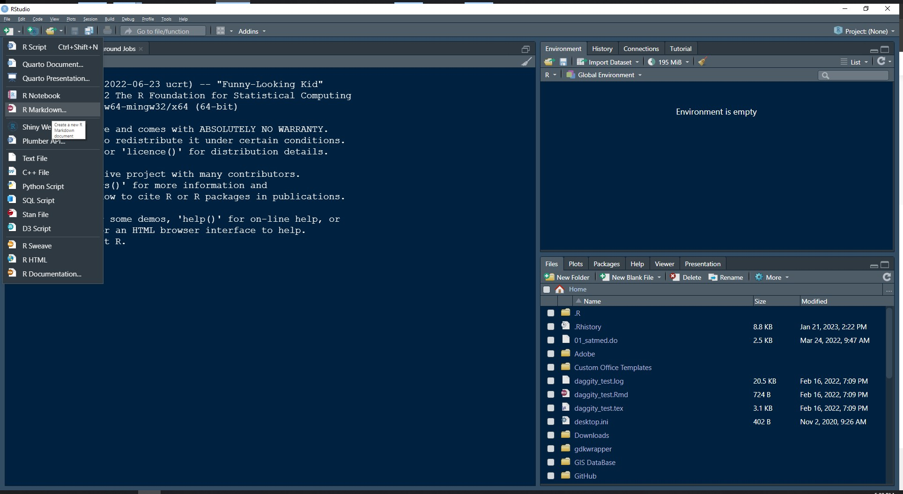
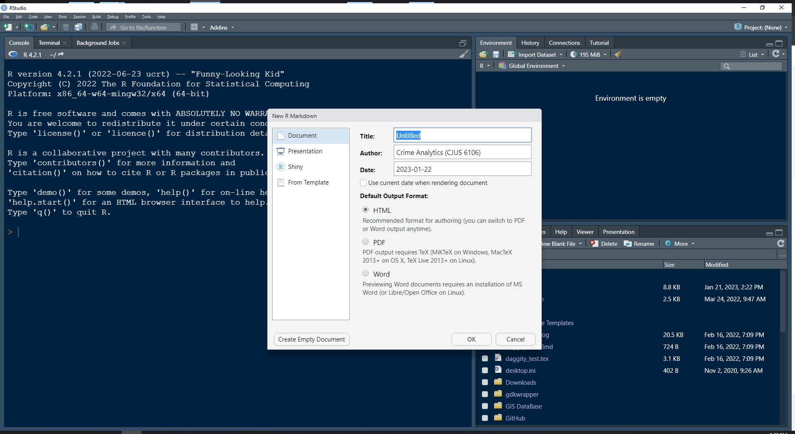
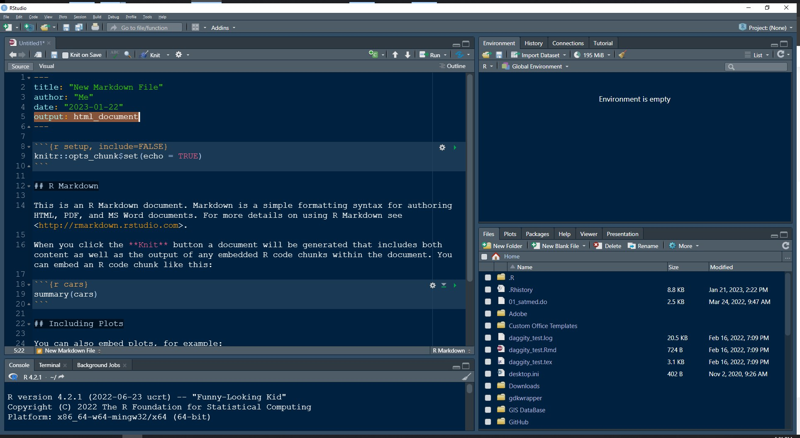
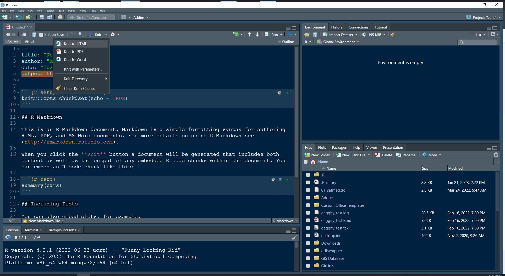
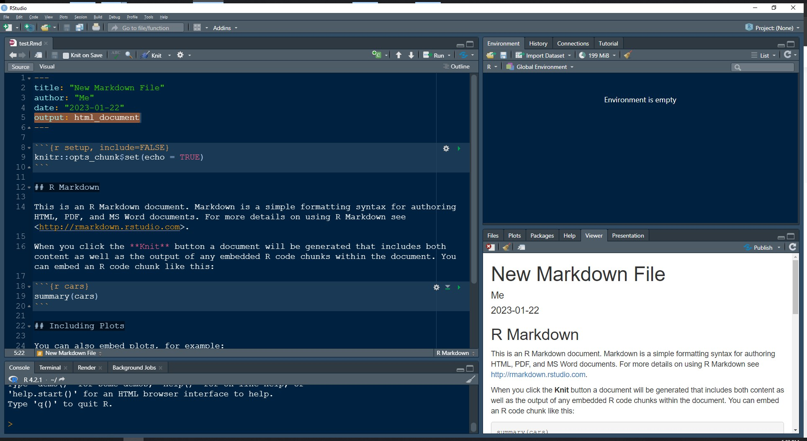
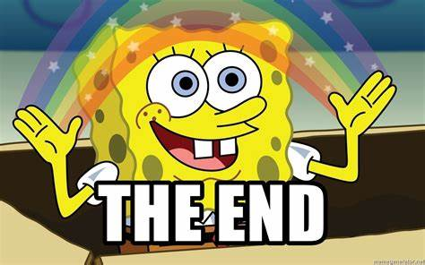

```{r setup, include=FALSE}
knitr::opts_chunk$set(echo = TRUE)
```

## What is Markdown?

Markdown is a text markup language that allows users to add formatting to plaintext documents. In a document that uses Markdown, the formatting changes you make are not immediately apparent as they are in other text editors like Microsoft Word. 

For example, to make text boldface I can put double asterisks ("\*\*") before and after it like so: **I made this text bold!**

Other formatting examples include headings using the \# symbol, italicized text using a single asterisk around the selected text, and making an outline using single asterisks or dashes. 

There's a very helpful guide to using the Markdown language [here](https://www.markdownguide.org/).

## Where is Markdown Used?

There are many different programs that use Markdown or allow Markdown to be used within them. Both Discord and Perusall allow for Markdown code to be used (I believe Canvas does as well). 

For the purposes of this course, we will use the Markdown language in R, allowing us to create documents within the RStudio interface.

## What is RMarkdown?

RMarkdown is simply a package that brings the utility of the Markdown language into R. It allows us to create documents with R that includes formatted text, code, and output. 

You can install RMarkdown quite easily using the following code:

```{r}
#install.packages("rmarkdown")
```

I can't run the code within this document, you can just take away the \# if you want to copy that line and install the package. 

RMarkdown differs from other packages in that you generally do not have to load it using the library() function. Rather, it adds additional functionality to RStudio. Specifically, installing the RMarkdown package allows you to create .rmd files, which are particular kinds of R scripts that contain Markdown language. 

Opening a .rmd file looks slightly different than opening a traditional script file. 



After you click on the RMarkdown file option in the dropdown menu a dialog box will then appear. This dialog box (picture below) allows you to name the document, provide an author name, and choose from several different Markdown file types. 



After you choose the file type, a new page will open in the Source window called "Untitled" that contains some default code chunks and text. The information you provided in the dialog box should now appear in the very first part of the document. This section is called the YAML ("Yet Another Markup Language") header. In general, you should **leave this section alone unless otherwise instructed**.



You can safely delete everything below the first code chunk (more on these below) that appears. This is what I call the setup code chunk. It's where you'll load libraries and set other global options for your document. 

While you are creating a Markdown script it is good practice to knit the file every now and again to make sure that the file can compile without encountering an error. Errors in the knitting process can involve incorrect Markdown code, incorrect R code, or incorrect LaTeX code. 

The Knit function is accessible through the options bar on the Source Pane - it is hard to miss with its thread and needle icon. 



In practice, you will just be pressing the Knit button and not using the dropdown menu from the button, though. Although you may choose a PDF, HTML, or Word document, you can knit a document into any of those formats from this menu. It will simply adjust your YAML header to change the document type. I recommend **against** doing this. Just click on the main Knit button when you want to knit your document, otherwise you may cause some errors down the road. 

So what happens after you press the knit button? A preview of your document will appear! If you are knitting a PDF document this will appear in a separate window that pops up. If you are knitting an HTML file, the preview appears within the lower right panel of RStudio like so:



## Introduction to Code Chunks

Code chunks are environments within a .rmd file where you are allowed to write R code. You may only include code that can be run in the Console pane within a code chunk, otherwise it will return an error. For example, I cannot write plain text within a code chunk as I can outside of it. 

To start a code chunk you have to be on a blank line in your document. You then type three grave accents ("`") in a row, followed by a squiggly bracket, the lowercase letter "r" and a close squiggly bracket. Press enter twice, then type three more consecutive grave accents. 

You should see that environment behind that code just changed color - this is your indication that the code chunk was created correctly. Now, you can enter R code within it. 

```{r, echo=TRUE, results=FALSE}
print("This is a code chunk")
```

You'll see above that the code chunk prints out a little differently than it looks within the .rmd, but this is what you should see if the code is set to print out in your knitted PDF. 


### Code Chunk Options

When using a code chunk there are a variety of options you can specify by typing a comma after the lowercase r. Here are some examples:

* **echo=TRUE/FALSE** - This will print (TRUE) the code within the code chunk into your document. You can suppress this behavior by typing FALSE instead (and remember that logical options require caps - **R is case-sensitive**)

* **include=TRUE/FALSE** - TRUE is the default behavior and includes the code chunk output in the knitted file. Specifying FALSE means that R will still run the code chunk, but will not echo the code or print the results in your knitted file. 

* **message=TRUE/FALSE** - Sometimes running code produces messages, TRUE will print these messages into your knitted file. TRUE is the default. I will generally set the global option for this to be FALSE for a professional document. 

* **warning=TRUE/FALSE** - Similar to message=, I also set this globally to FALSE in professional documents. 

There are also multiple options that work with graphs. We will explore those in more depth later in the semester. 

Code chunks aren't the only way to include R code in a .rmd file, though. 

## Inline Code

You can also write code within the text outside of a code chunk. This still requires you to set the environment properly. 

To create an inline code environment you need to begin it with a single grave accent, follow that with a lowercase r, then a space and one more grave accent. All text within this environment will be interpreted as R code, so be careful what you write here. 

I generally use these sections to print results within text passages. Suppose I wanted to know the range of a variable and I know the maximum is 8934 and the minimum is 540. I can calculate this using inline code like so: \` "r  8934-540" \`.

I stopped the code from running above by using the backslash escape character and some double quotation marks - here's what it will print out: `r 8934-540`.

You can use regular R functions here and reference objects that exist within your global environment 

## Knitting a PDF Document

Knitting a PDF document is very straightforward. It requires you to have downloaded and installed the tinytex package because the language used to knit the PDF is LaTeX. 
LaTeX is another document markup language! Hopefully you're not having too much trouble keeping track of all of them at this point. 

The main benefit of LaTeX, from my point of view, is that it allows users of RMarkdown to write equations into a document much more easily than you can in other document markup languages. 

It's useful to think of LaTeX as the code underlying a typical document that you might use MS Word to produce (because that's what it is). The primary benefit, then, is that you can write code once and reuse it in perpetuity. In Word, you usually have to use the point and click menus to do everything each time. 

In addition to equations, LaTeX also allows users to have a lot of control over how figures and tables appear in knitted documents, either through adjusting the YAML header, editing within the text of the .rmd file, or in separate formatting documents written in plaintext files. 

## Final Words

Markdown is a versatile document markup language that works within R and with various other types of markup languages like YAML and LaTeX.

There's a bit of a learning curve to it, but once you get the hang of it, it is really helpful to be able to build an analysis into a document naturally rather than adding it from a separate statistical package. 

RMarkdown combines the generally separate tasks of analysis and writeup and, in doing so, alleviates some double-work you may otherwise be doing if you use separate programs for both. 




