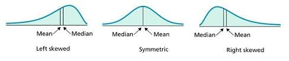
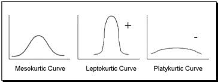

```{r setup, include=FALSE}
knitr::opts_chunk$set(echo = TRUE)
```

## Interacting With Data

This part of the course will focus on how we can start to get to know our data, once we've imported it into the R Environment.

Then we will discuss basic querying and reporting of the data. 

To be able to interact with data, our data need to be **tidy**.

## What does it mean when data are tidy?

**I'm so glad you asked!**

At the end of your data cleaning journey, the goal is to have:

1. The raw data (original)
2. A tidy data set (the final data ready to analyze)
3. A code book describing each variable in the data
4. An explicit record of how you got from (1) to (2) (and maybe 3, if you're making your own code book)

**Raw data** 

* Unformatted spreadsheet full of empty cells and typos
* Complicated JSON data from Twitter
* Hand-entered numbers you put in from observational data

Raw data = messy data.

How do you know that data are raw?

* You ran no software on the data
* You did not manipulate any variables in the data
* You did not remove any data from the data set
* You did not summarize the data in any way

***But what is tidy data?***

Tidy data are data files in which:

* Every variable is measured in its own column
* Every observation (case) has its own row
* Variable names are in the very top row (a "header")
* Values of variables are common (spelled the same in all instances)
* *There is a linking variable if you have multiple tables*

Pro tips:

- The top row of the data set should have variable names (a "header")
- Variable names should be human readable ("stealcar" vs. "s1lego21")
- Data should be saved in one table per file
     + You may have several tables from the same source
     + Those should be stored in multiple files

**How do I make a record of how I got from my raw data to my tidy data?**

That's what R does - and that's why it's so important to save the R scripts.

**What's a code book?**

* Information about the variables
     + Units
     + Values for numerical codes (1 = male, 2 = female)
* Information about any summary choices you made 
     + Collapse variables into bins
     + Removed missing codes or categories with very few observations
     + Removed observations entirely
* Information about how the data were gathered
     + Experimental design
     + Sampling strategy
     + Response rates
     
Common formats for codebook

* Word processing document
* Pdf 

## Process of Data Cleaning

**3 Step Process**

Screening > Diagnosing > Editing

Screening

* Examine the variables you want to use
* How do they behave?
* Are there any unusual values?

Diagnosing

* When you find abnormalities, what could explain them?
* Check the codebook
* Errors could be introduced before or after measurement

Editing

* How can you fix those abnormalities?
* Do you remove the value?
* Do you remove the observation?
* Do you recode the variable you have into a different form?
* Do you need to declare any values as missing?

Then the process starts over, until all the variables you need are clean and ready for analysis.

**Sources of Errors**

*Single Source Errors*

* Illegal values
     + Values outside of the permissible range
     + Birthday - June 31, 1990
* Violated attribute dependencies 
     + Current age = current year - birth year
* Uniqueness violation
     + Things that shouldn't have replicated values (SSN, Student ID) don't have them
* Integrity of references
     + All codes should be specified 
     + If you use numerical codes for major in college, all numerical codes should have a major attached to it
* Misspellings (Aug and August in same data set)
* Missing values 
* Misfielded values (city = "Germany")
* Transpositions (J. Smith, Miller P.)
     
*Multiple Source Errors*

The main problem here is overlapping data

If you have the same data reflected in two tables, those entries should match

Names should be spelled the same, addresses, genders, etc. should match

## I HAVE TIDY DATA!

**NOW WHAT??**

At this point you want to begin to interact with your data to understand things like:

* What variables you have
* How those variables are coded
* How the variables "behave"
* What patterns exist between the variables

Interacting with data consists of things you've already learned, like **importing**, checking the **class** and **structure** of the data, and looking at **summary** statistics of the data frame.

## Querying the data

Querying just means asking basic questions of your data, getting it to tell things about itself.

Most querying is concerned with either a single variable (univariate analysis) or with relationships between two variables (bivariate)

### Simple data query commands

> table()

> summary()

These commands show us 

* The values that occur and the frequency with which they occur
* Summary statistics for the variable

How you go about querying data should depend on level of measurement.

### Level of Measurement:

-- The degree of mathematical complexity with which the values of your variable

**4 Levels of Measurement**

*For practical matters, there are really only three...*

1. Nominal
2. Ordinal
3. Interval
4. Ratio

#### **Nominal Measures**

-- The different values of the variable don't have any mathetical interpretation

* The values are just different categories
* "More" and "less" are not meaningful concepts here
* The values differ only in *kind*, not in *amount*

##### Examples: 

* Gender (male, female)
* Race/Ethnicity (African American, Hispanic, White)
* College Major (Business, Art, Criminal Justice, Psychology)

-- What are other examples?

What mathematical operations can you do with **nominal** measures?

- Equal or not equal

#### **Ordinal Measures**

-- The values represent an inherent rank order, permitting a "greater-than" or "less-than" comparison

The distance between the values is not standard or uniform.

* Values can be rank ordered
* "More" and "less" are now meaningful
* The values differ in amount, *but you don't necessarily know how much they vary*

##### Examples: 

* Class rank (Freshman, Sophomore, Junior, Senior)
* Military rank (Private, Sergeant, Lieutenant, Captain, General)
* Prison security classes (Minimum, Medium, Maximum, Supermax)

-- Others?

What mathematical operations can you do with **ordinal** measures?

- Equal or not equal
- Greater than or less than

#### **Interval Measures**

-- The values can be rank ordered, and there is a fixed distance between them

* There is no true zero with interval measures
* True zero means a literal absence of the thing under consideration

##### The classic example - **Temperature**

* A temperature of zero doesn't mean there is no temperature

What mathematical operations can you do with **interval** measures?

- Equal or not equal
- Greater than or less than
- Addition and subtraction

#### **Ratio Measures**

The most mathetical complexity of all.

* Rank order
* Fixed distance between the values
* True zero

A zero on this variable measure literally means there is nothing of the thing you're talking about.

That means you can form ratios (twice as much, a third as much, etc.)

##### Examples:

* Number of arrests you had in the last six months
* Number of times your tweet got retweeted
* Number of beers you drank in the past week

What mathematical operations can you do with **ratio** measures?

- Equal or not equal
- Greater than or less than
- Addition and subtraction
- Multiplication and division

### The Hierarchy of Level of Measurement

-- Variables measured at the ratio level can also be measured at the interval, ordinal, or nominal levels

-- Variables measured at the interval level can also be measured at the ordinal or nominal level

-- Variables measured at the ordinal level can also be measured at the nominal level

*But it doesn't go the other way!*

The practical implication - always measure things at the highest level of measurement you can the first time you measure it. You can always change it to a lower level later if you need to.

One more practical matter.

* In the social sciences, interval and ratio measures are generally lumped together.
* Interval/ratio measures
* There are precious few times when the distinction matters
* There are even fewer actual interval measures that we care about in the social sciences

### What statistics can you calculate for the levels of measurement?

Statistic           | Nominal | Ordinal | Interval | Ratio
--------------------|:-------:|:-------:|:--------:|:-----:
Mode                |    x    |   x     |    x     |   x
Median              |         |   x     |    x     |   x
Mean                |         |         |    x     |   x
Standard Deviation  |         |         |    x     |   x

### A super quick review of univariate statistics:

* Mode - the most commonly occurring value in a distribution
* Median - the value in the middle of a rank-ordered distribution
* Mean - the arithmetic average of the distribution

**Calculating the median**

* If there are an odd number of observations:
     + $\frac{N+1}{2}$
     
* If there are an even number of observations:
     + $\frac{N}{2}$
     + $\frac{N+2}{2}$
     + Take the average of those two numbers
     
The median is sometimes referred to as the 50th percentile
     
**Calculating the mean**

> $\bar{x} = \Sigma\frac{x_{i}}{n}$

**Calculating the standard deviation**

> $s= \sqrt{\normalsize\frac{\Sigma(x_{i} - \overline{x})^{2}}{n-1}}$

**Skewness**

> $\text{Skewness} = \frac{\Sigma(x_{i} - \overline{x})^{3}}{(n-1)(s^{2})}$



**Kurtosis**

> $k = \frac{\Sigma(x_{i} - \overline{x})^{4}}{(n-1)(s^{4})}$



## Things that depend on level of measurement:

* The data cleaning and transformations necessary
* Types of visualizations
* Statistical tests
* Predictions you can make
* The kinds of questions you can answer

## How R Understands Level of Measurement

"Classes"

* Factor (Nominal or ordinal)
* Integer (Interval/Ratio)
* Numeric (Interval/Ratio - but with decimals!)
* Character (Nominal or ordinal)

## DATA QUERYING

```{r}
# Opening data
nsyr <- read.csv("nsyr_w3.csv")
```

```{r}
table(nsyr$I.RELIGION)
```

The codebook gives us more information on these codes

* 1 = Mainline protestant
* 2 = Evangelical protestant
* 3 = Black protestant
* 5 = Catholic
* 8 = Other Religion
* 9 = Not religious

We can also coerce R to show us these labels.

```{r}
religion <- nsyr$I.RELIGION
class(religion)
religion<-as.factor(religion)
levels(religion)<-c("Mainline Protestant","Evangelical Protestant",
                    "Black Protestant","Catholic","Other Religion","Not Religious")

table(religion)
```

This makes the output a little "prettier".

```{r}
table(nsyr$ANGELS)
```

We'll talk about what to do with the 777, 888, and 999 codes later in the course, but they denote that a respondent either skipped the question, refused to answer, or didn't know the answer.

```{r}
angels<-as.factor(nsyr$ANGELS)
levels(angels)<-c("Definitely",
                  "Maybe",
                  "Not at all",
                  "Don't know",
                  "Refused",
                  "Skipped")
table(angels)
```

Neat! Let's see how those two variables behave together by looking at a contingency table.

I want to see the distribution of belief in angels *contingent* on religion.

```{r}
table(religion,angels)
```

Fun! But what about *demons*?

```{r}
demons<-as.factor(nsyr$DEMONS)
levels(demons)<-c("Definitely",
                  "Maybe",
                  "Not at all",
                  "Don't know",
                  "Refused",
                  "Skipped")
table(religion,demons)
```

### All of the above dealt with categorical variables. 

Querying continuous variables looks a little different. 

You can ask for a table.

```{r, echo=FALSE}
# Creating a new variable, and recoding the missing values
firstdate<-nsyr$AGEFSTDT
firstdate[nsyr$AGEFSTDT==777]<-NA
firstdate[nsyr$AGEFSTDT==888]<-NA
firstdate[nsyr$AGEFSTDT==999]<-NA

idealmarry<-nsyr$MARRYMIN
idealmarry[nsyr$MARRYMIN==101]<-NA
idealmarry[nsyr$MARRYMIN==777]<-NA
idealmarry[nsyr$MARRYMIN==888]<-NA
idealmarry[nsyr$MARRYMIN==999]<-NA
```

```{r}
table(firstdate)
table(idealmarry)
```

This shows you each value that occurs and how many times each value occurs. It gives you a frequency distribution.

If you variable is measured at the interval/ratio level, you'll probably also be interested in the measures of central tendency and variation.

You can get those with these commands:

> summary()

> mean()

> sd()

> skewness()

> kurtosis()

Those last two functions require the **"moments"** package.

```{r}
library(moments)
summary(firstdate)
mean(firstdate, na.rm=TRUE)
sd(firstdate, na.rm=TRUE)
skewness(firstdate, na.rm=TRUE)
kurtosis(firstdate, na.rm=TRUE)
```

## Bivariate data querying with continuous variables

```{r}
table(idealmarry,firstdate)
```

Well that's certainly gross and very unhelpful.

Instead, we might ask for a bivariate correlation. This measure ranges from 0-1 and tells us how tightly correlated the two variables are.

```{r}
cor(idealmarry,firstdate, use="complete.obs")
```

The correlaton of 0.03 is very weak, and tells us that these two variables aren't particularly correlated.

A simple scatterplot would show you the same thing.

```{r}
plot(idealmarry,firstdate,
     ylab="Age of First Date",
     xlab="Ideal Age to Get Married",
     col="black")
```

**That's just a hot mess.** 

No real pattern or any type of correlation.

## Bivariate Querying - Mixed Levels of Measurement

What if you have a categorical and a continuous variable, and you want to know if the level of the continuous variable differs by the categories of the categorical variable?

Use the almost magical **describeBy()** function.

```{r}
sex<-as.factor(nsyr$I.SEX)
levels(sex)<-c("Male","Female")
table(sex)
```

```{r, warning=FALSE}
library(psych)
describeBy(idealmarry, sex)
```

## It's been a long week and lecture, so...

...here's a picture of my dog. 

